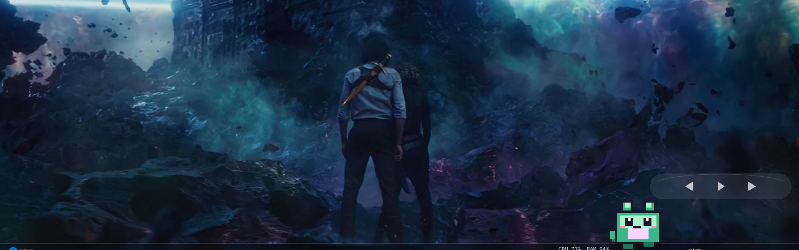
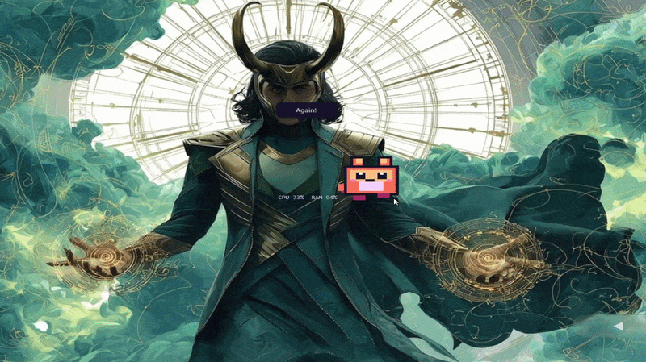

# ASTROXZ Pixel Pet 🐾

A self-contained animated desktop companion built with Python and PySide6.

Pixel Pet procedurally draws its own pixel art, so it does not require external image assets.

## 📸 Preview



## 🎬 Demo



## ✨ Features

- 💤 Idle, walking, sleeping, happy, and surprised states
- 🚶 Random movement along the bottom of the screen
- 🎨 Crisp procedural pixel-art character
- 🖱️ Drag the pet with the left mouse button
- 🐾 Double-click to play
- 🖱️ Right-click for controls
- 📌 System tray menu
- ⏸️ Pause/resume movement
- 📍 Always-on-top toggle
- 🎨 Four color themes: Violet, Ocean, Sunset, and Mint
- 📊 Optional CPU/RAM display
- 💾 Saved position and settings
- 🖥️ Multi-monitor-aware placement
- 🚀 Optional Start with Windows launcher
- 🪟 Windows DPI awareness

### 🧠 Living Memory & Personality

Pixel Pet has a lightweight persistent memory system that allows its behavior to change gradually over time.

- 💾 Persistent hidden life memory
- 🌅 Time-of-day behavior: morning, afternoon, evening, and night
- 🧠 Gradual personality drift based on play, quiet time, screen activity, themes, and night activity
- 👋 Gentle return recognition after time away
- 😴 Sleep progression: sleepy → sitting → sleeping → dreaming
- ✨ Rare mystery moments with tiny visual effects
- 🌱 Subtle long-term visual evolution without game-like unlocks
- 💬 Non-repeating, mood-aware speech with quiet periods

Pixel Pet is designed to be a companion, not a game that demands maintenance.

There is:

- ❌ No hunger
- ❌ No health system
- ❌ No death
- ❌ No punishment
- ❌ No maintenance pressure

## 🚀 Installation

Open PowerShell in the project folder and run:

```powershell
py -m venv .venv
.\.venv\Scripts\Activate.ps1
python -m pip install --upgrade pip
pip install -r requirements.txt
```

## ▶️ Run

```powershell
python main.py
```

The pet will appear near the bottom-right of the current screen.

Right-click the pet or its tray icon for controls.

Double-click the pet to play.

## 🪟 Build a Windows Executable

If you want to create a standalone Windows executable:

```powershell
pip install pyinstaller
pyinstaller --noconsole --onefile --name PixelPet main.py
```

The executable will be created in:

```text
dist\PixelPet.exe
```

## ⚙️ Data & Settings

Pixel Pet stores its settings and memory locally in your Windows user profile.

```text
%APPDATA%\PixelPet\
```

Settings:

```text
settings.json
```

Persistent life memory:

```text
memory.json
```

The **Start with Windows** option creates:

```text
%APPDATA%\Microsoft\Windows\Start Menu\Programs\Startup\PixelPet.cmd
```

## 📝 Notes

* If you want the pet below normal application windows, disable **Always on top** from the tray menu.
* The project currently uses procedural pixel art rather than external image assets.
* Custom artwork could be added later by replacing `PixelPainter.draw_pet()` with a sprite-sheet loader while keeping the behavior system unchanged.

## 🛠️ Built With

* Python
* PySide6
* Windows APIs

---

### 👨‍💻 Created by ASTROXZ

**Think it. Build it. Improve it.**
